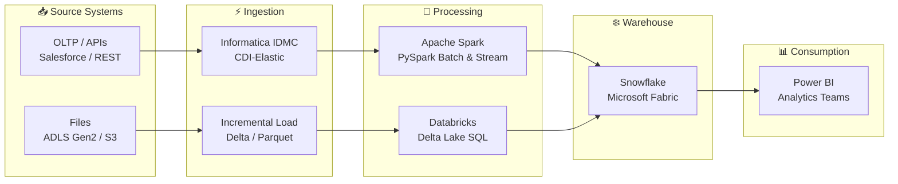

  

   

  &nbsp;
  &nbsp;
  &nbsp;
  

---

## 👨‍💻 About Me

Data Engineer with **1.5+ years** of production experience at **Informatica** and **Salesforce** building scalable ETL pipelines, tuning Spark jobs, and delivering analytics-ready data in cloud environments.

- 🔥 Spark performance tuning — eliminated OOM errors on large-scale pipelines at **Salesforce**
- ❄️ Cut ETL runtime **60 min → 15 min (75%)** using Snowflake + Databricks at **Informatica**
- 🔄 Automated 80% of manual ETL triggers via scheduled workflows + REST API monitoring
- ☁️ Production experience across **AWS (S3, EKS, Redshift)**, **Microsoft Fabric (ADLS Gen2)**, and **Databricks**

---

## 📊 Impact at a Glance

<table align="center">
  <tr>
    <td align="center"><h2>⚡ 75%</h2><b>ETL Runtime Reduction</b> 60 min → 15 min</td>
    <td align="center"><h2>🤖 80%</h2><b>Manual Effort Eliminated</b> Workflow Automation</td>
    <td align="center"><h2>📦 40%</h2><b>Faster Data Delivery</b> Pipeline Optimization</td>
    <td align="center"><h2>🔄 70%</h2><b>Data Refresh Efficiency</b> Incremental Load Framework</td>
  </tr>
</table>

---

## 🛠️ Tech Stack

**Languages**

**Big Data & Processing**

**Cloud & Data Platforms**

**Databases**

**DevOps & Orchestration**

---

## 🏗️ Data Architecture

---

## 📌 Featured Projects

| Project | What It Solves | Tech |
|---|---|---|
| [**incremental-etl-pipeline**](https://github.com/Techkrish1/incremental-etl-pipeline) | Production-grade incremental ETL — idempotency, dedup, schema evolution, DQ gates | Python · SQL · Delta Lake |
| [**retail-delta-warehouse**](https://github.com/Techkrish1/retail-delta-warehouse) | SCD Type 2 historical tracking on retail transactions using Delta Lake | Databricks · Delta Lake · SQL |
| [**workforce-delta-warehouse**](https://github.com/Techkrish1/workforce-delta-warehouse) | HR analytics — slowly changing employee dimension with full audit trail | Databricks · Delta Lake · SQL |
| [**retail-product-catalog**](https://github.com/Techkrish1/retail-product-catalog) | SCD Type 1 product master data pipeline with upsert semantics | Databricks · Delta Lake · SQL |
| [**de-problems-portfolio**](https://github.com/Techkrish1/de-problems-portfolio) | Real-world DE problems — CDI, CDIE, PySpark, Snowflake, ADLS | Python · PySpark · Snowflake |
| [**de-interview-prep**](https://github.com/Techkrish1/de-interview-prep) | Structured DE interview notes: Spark, Kafka, SQL, system design, behavioral | Markdown · SQL · PySpark |

---

## 🎓 Certifications

| Certification | Issuer | Level |
|---|---|---|
| ☁️ Cloud Data Integration Developer | Informatica | Professional |
| 🔍 Cloud Data Quality | Informatica | Professional |
| 🗄️ Cloud Data Governance and Catalog | Informatica | Professional |
| 🔗 Master Data Management 10.4 Developer | Informatica | Professional |
| 📘 Introduction to IDMC | Informatica | Associate |

---

## 🌱 Currently

- Building production-grade DE projects with **Delta Lake**, **PySpark**, and **Snowflake**
- Deepening expertise in **Kafka Streaming**, **dbt**, and **data system design at scale**
- Exploring **AI/ML integration** patterns in data pipelines

---

  <b>Let's build data products that scale. Reach out!</b>
    
  &nbsp;
  

